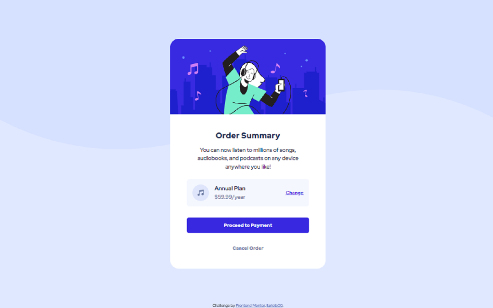

# Frontend Mentor - Order summary card solution

This is a solution to the [Order summary card challenge on Frontend Mentor](https://www.frontendmentor.io/challenges/order-summary-component-QlPmajDUj). Frontend Mentor challenges help you improve your coding skills by building realistic projects.

## Table of contents

- [Overview](#overview)
  - [Screenshot](#screenshot)
  - [Links](#links)
  - [Built with](#built-with)
  - [What I learned](#what-i-learned)
- [Author](#author)
- [Acknowledgments](#acknowledgments)

## Overview

### Screenshot

### Links

- Solution URL: [Frontend Master]()
- Live Site URL: [Github Pages]()

### Built with

- Semantic HTML5 markup
- CSS custom properties
- CSS flexbox
- Bootstrap Mobile First Design
- [Bootstrap 5.3.0](https://getbootstrap.com/)

### What I learned

My 4th Frontend Mentor Challenge. I expected to finish this project around 1H 30min, around the same time as my last challenge but, this one took me more than 2H. I learned quite a few things from this challenge;

- First is regarding the main content wrapper, I learned from my fellow developers in Frontend Master Discord that I should use `min-height: 100vh;` instead of `height: 100vh;`, as to not mess up my layout when the content is longer than the viewport height.

- Second is regarding the techniques used to analyzed the design and layout of the challenge. I learned that using tools PS, Adobe XD, etc. (I just used Paint, yes, it works) to analyze the width/height of the components is better than just using your eyes. Yes, pretty obvious but I didn't think of it before, I felt stupid for it.

## Author

- Frontend Mentor - [@llariola00](https://www.frontendmentor.io/profile/llariola00)

## Acknowledgments

I give my sincere thanks to @Grace-Snow for helping me with the `min-height: 100vh;` issue. I also give my sincere thanks to @Shaun for his advice on a post, as it led me to @Grace-Snow's advice.
